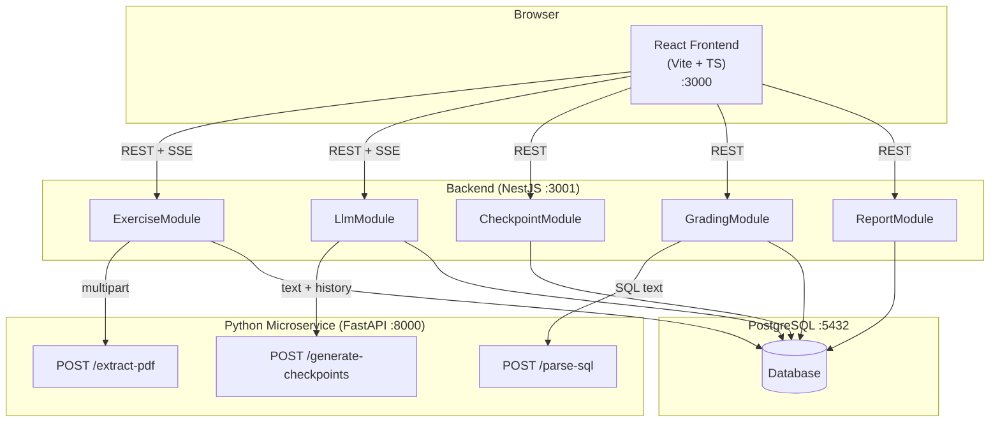
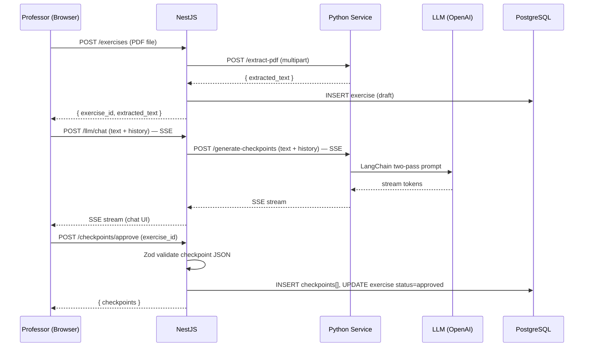
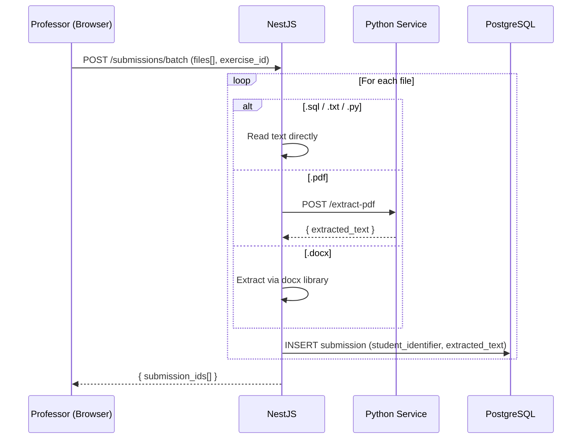
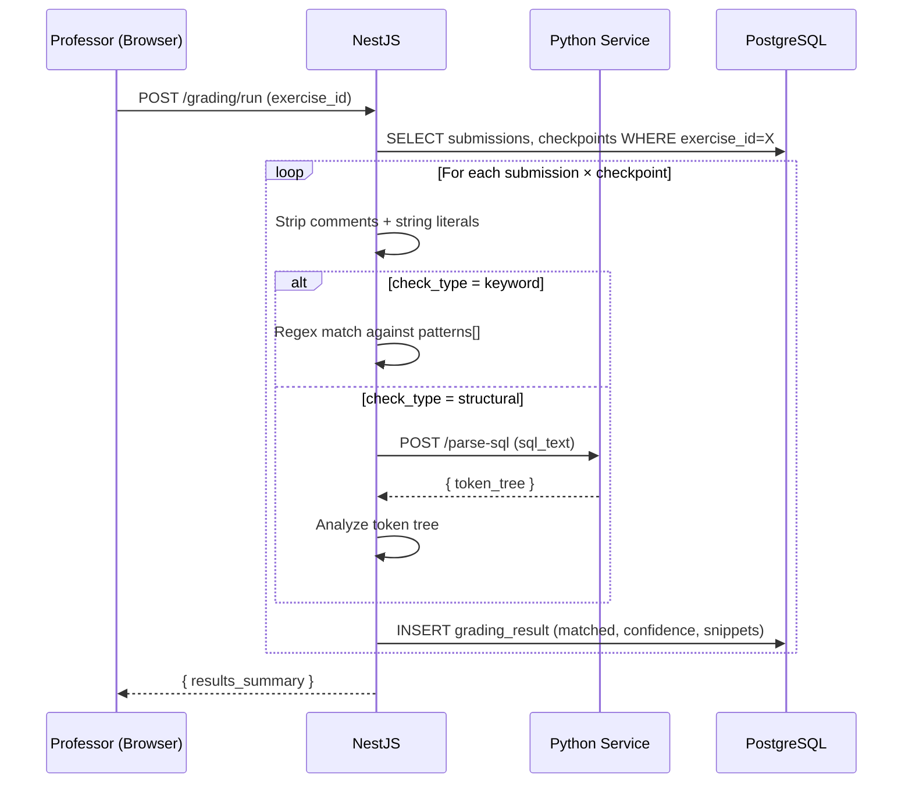

# ExamChecker — Architecture

## Service Overview

Three services communicate over HTTP. Only the backend is exposed to the frontend.
The Python microservice is internal-only.



---

## Data Flow by Phase

### Phase 1: Checkpoint Extraction



### Phase 2: Student Upload



### Phase 3: Automated Grading (No LLM)



---

## PostgreSQL Schema

```
┌─────────────────────────────────────────────────────────────────┐
│ exercises                                                        │
│ id UUID PK | title | original_pdf_path | extracted_text         │
│ status ENUM(draft,approved) | created_at | updated_at           │
└──────────────────┬──────────────────────────────────────────────┘
                   │ 1:N
    ┌──────────────┼──────────────────┐
    │              │                  │
    ▼              ▼                  ▼
┌───────────┐ ┌───────────┐ ┌────────────────────┐
│conversation│ │checkpoints│ │submissions         │
│_messages  │ │           │ │                    │
│id UUID PK │ │id UUID PK │ │id UUID PK          │
│exercise_id│ │exercise_id│ │exercise_id FK      │
│role ENUM  │ │description│ │student_identifier  │
│content    │ │patterns   │ │original_file_path  │
│created_at │ │JSONB      │ │extracted_text      │
│           │ │match_mode │ │created_at          │
│           │ │check_type │ └────────┬───────────┘
│           │ │case_sens. │          │ 1:N
└───────────┘ │order_index│          ▼
              └─────┬─────┘ ┌────────────────────┐
                    │       │grading_results     │
                    │ 1:N   │id UUID PK          │
                    └──────►│submission_id FK    │
                            │checkpoint_id FK    │
                            │matched BOOLEAN     │
                            │confidence FLOAT    │
                            │matched_patterns    │
                            │JSONB               │
                            │matched_snippets    │
                            │JSONB               │
                            └────────────────────┘
```

---

## Key Design Decisions

- **LLM only in setup** — grading is 100% deterministic regex/AST matching (see ADR-0002)
- **Python microservice** — PDF and LLM work stays in Python; NestJS stays as the REST orchestrator (see ADR-0003)
- **SSE for streaming** — LLM responses stream token-by-token via Server-Sent Events; each chat turn is a fresh HTTP request
- **Conversation trimming** — context sent to LLM = original extraction + current checkpoint JSON + last N messages (prevents token overflow)
- **Zod validation** — checkpoint JSON is validated before storage to ensure pattern integrity
