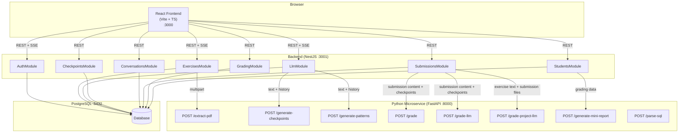
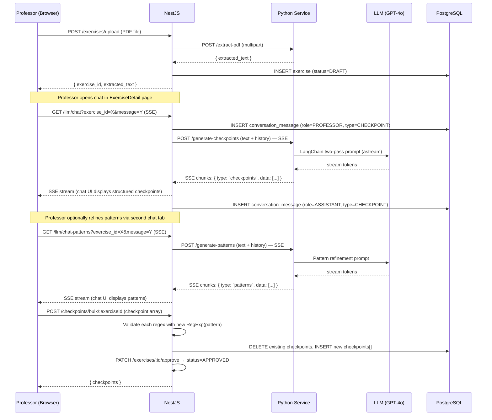
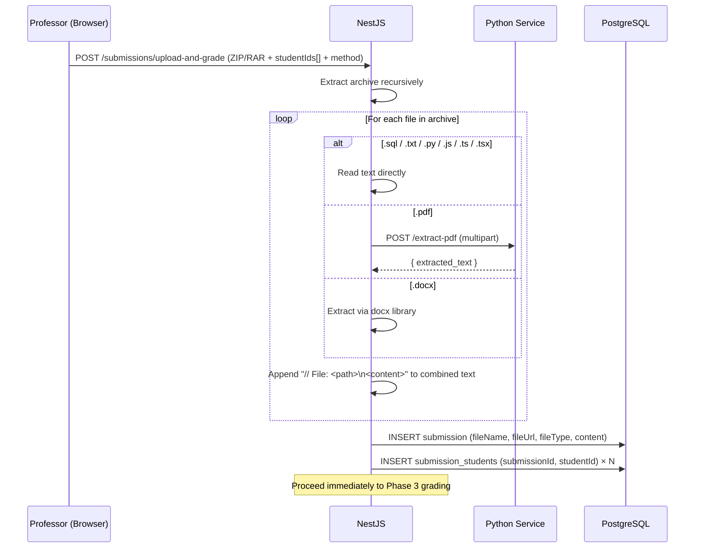
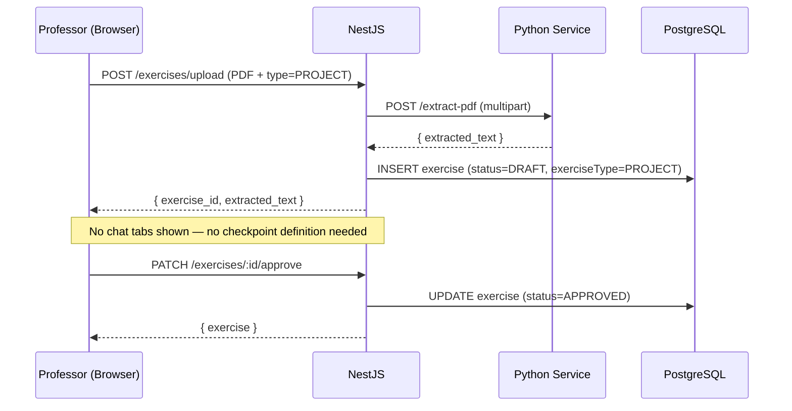
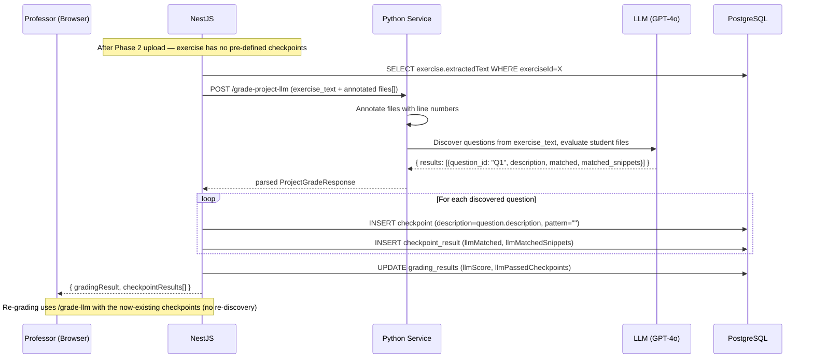

# ExamChecker — Architecture

## Service Overview

Three services communicate over HTTP. Only the backend is exposed to the frontend.
The Python microservice is internal-only.



---

## Data Flow by Phase

### Phase 1: Checkpoint Extraction



### Phase 2: Student Submission Upload



### Phase 1 (Project variant): Project Exercise Creation



---

### Phase 3: Automated Grading — Two Methods

```mermaid
sequenceDiagram
    participant P as Professor (Browser)
    participant N as NestJS
    participant Py as Python Service
    participant LLM as LLM (GPT-4o)
    participant DB as PostgreSQL

    note over N,Py: Triggered automatically after Phase 2 upload

    N->>DB: SELECT checkpoints WHERE exerciseId=X
    N->>Py: POST /grade OR /grade-llm (submission content + checkpoints)

    alt method = "regex" (deterministic)
        loop For each checkpoint
            Py->>Py: Compile re.compile(pattern, flags)
            alt .sql file
                Py->>Py: Split into blocks (PROCEDURE/TRIGGER/FUNCTION)
            end
            Py->>Py: Search file; collect {file, line_number, full_line}
        end
        Py-->>N: { results: [{checkpoint_id, matched, matched_snippets}] }
        N->>DB: UPDATE checkpoint_results: matched, matchedSnippets
        N->>DB: UPDATE grading_results: score, passedCheckpoints
    else method = "llm" (semantic)
        Py->>Py: Annotate files with line numbers
        Py->>Py: Format checkpoints with description + regex hint
        Py->>LLM: ChatOpenAI invoke (JSON response format)
        LLM-->>Py: { results: [{checkpoint_id, matched, matched_snippets}] }
        Py-->>N: parsed results
        N->>DB: UPDATE checkpoint_results: llmMatched, llmMatchedSnippets
        N->>DB: UPDATE grading_results: llmScore, llmPassedCheckpoints
    end

    N-->>P: { gradingResult, checkpointResults[] }

    note over P,N: Both regex and LLM results can coexist on the same submission
```

### Phase 3 (Project variant): LLM Question Discovery + Grading

Applies when the submission belongs to a **PROJECT** exercise and no checkpoints exist yet.



---

## PostgreSQL Schema

```
┌──────────────────────────────────────────────────────────────────┐
│ users                                                             │
│ id | username (unique) | password | role | createdAt | updatedAt │
└───────────────────────┬──────────────────────────────────────────┘
                        │ 1:N (teacherid)
          ┌─────────────┼──────────────────────┐
          │             │                      │
          ▼             ▼                      ▼
┌─────────────┐  ┌─────────────────┐   ┌──────────────────┐
│ exercises   │  │ students        │   │                  │
│ id UUID PK  │  │ id UUID PK      │   │                  │
│ title       │  │ studentIdentif. │   │                  │
│ pdfUrl      │  │ firstName       │   │                  │
│ status ENUM │  │ lastName        │   │                  │
│ DRAFT       │  │ email           │   │                  │
│ APPROVED    │  │ miniReport      │   │                  │
│ GRADED      │  │ miniReportAt    │   │                  │
│ type ENUM   │  │ teacherid FK    │   │                  │
│ EXERCISE    │  └────────┬────────┘   │                  │
│ PROJECT     │           │            │                  │
│ extractedTxt│                        │                  │
│ teacherid FK│                        │                  │
└──────┬──────┘           │            │                  │
       │ 1:N              │            │                  │
  ┌────┼──────────┐       │            │                  │
  │    │          │       │            │                  │
  ▼    ▼          ▼       │            │                  │
┌────────────┐ ┌────────────┐         │                  │
│conversat.  │ │checkpoints │         │                  │
│id UUID PK  │ │id UUID PK  │         │                  │
│exerciseId  │ │exerciseId  │         │                  │
│role ENUM   │ │order INT   │         │                  │
│PROFESSOR   │ │description │         │                  │
│ASSISTANT   │ │pattern     │         │                  │
│content     │ │caseSensitive│         │                  │
│type ENUM   │ │patternDesc.│         │                  │
│CHECKPOINT  │ │indicatorSol│         │                  │
│PATTERN     │ └──────┬─────┘         │                  │
└────────────┘        │               │                  │
                      │               │                  │
┌─────────────────────┼───────────────┘                  │
│submissions          │                                  │
│id UUID PK           │                                  │
│exerciseId FK ───────┘                                  │
│fileName             │                                  │
│fileUrl              │ M:N via submission_students       │
│fileType             │ (submissionId, studentId)        │
│content (combined)   │◄───────────────────────────────  │
└──────────┬──────────┘                                  │
           │ 1:1                                         │
           ▼                                             │
┌─────────────────────────────────────────────────────┐  │
│ grading_results                                     │  │
│ id UUID PK | submissionId (UNIQUE FK)               │  │
│ totalCheckpoints | passedCheckpoints | score FLOAT  │  │
│ teacherScore (nullable override)                    │  │
│ llmPassedCheckpoints (nullable) | llmScore (nullable│  │
│ gradedAt                                            │  │
└───────────────────────┬─────────────────────────────┘  │
                        │ 1:N                             │
                        ▼                                 │
┌─────────────────────────────────────────────────────┐  │
│ checkpoint_results                                  │  │
│ id UUID PK                                          │  │
│ gradingResultId FK | checkpointId FK                │  │
│ matched BOOLEAN | matchedSnippets String[]          │  │
│ llmMatched BOOLEAN (nullable)                       │  │
│ llmMatchedSnippets String[] (nullable)              │  │
│ UNIQUE (gradingResultId, checkpointId)              │  │
└─────────────────────────────────────────────────────┘  │
```

---

## Key Design Decisions

- **Two exercise types** — `EXERCISE` (standard, professor-defined checkpoints) and `PROJECT` (open-ended, LLM discovers questions at grading time). The `exerciseType` field on exercises controls the entire downstream workflow.
- **Three grading methods** — Deterministic regex (Method A), LLM semantic with pre-defined checkpoints (Method B), and LLM question discovery for projects (Method C). A and B can coexist on the same submission; C is project-only. See ADR-0002.
- **Pattern matching in Python** — All regex evaluation happens inside the Python microservice (`grading_service.py`), not in NestJS. This keeps grading logic alongside PDF extraction and LLM logic (see ADR-0003).
- **Project grading via `/grade-project-llm`** — For PROJECT exercises the Python service first extracts questions from the exercise PDF text using GPT-4o, then evaluates whether the student submission addresses each question. Results are saved as dynamically created checkpoints using the `llmMatched` / `llmMatchedSnippets` fields.
- **Python microservice** — PDF extraction, LLM calls, regex grading, semantic grading, and project question discovery all live in the Python service; NestJS is the REST orchestrator and database owner (see ADR-0003).
- **SSE for streaming** — LLM responses stream token-by-token via Server-Sent Events; NestJS proxies the SSE stream from Python to the browser. Each chat turn is a fresh HTTP request.
- **Two chat flows** — Checkpoint generation and pattern generation are separate SSE endpoints and separate conversation histories (`type: CHECKPOINT | PATTERN`). Neither is shown for PROJECT-type exercises.
- **Submission grading is immediate** — Grading runs automatically right after file upload (`upload-and-grade`), not as a separate step.
- **Teacher override** — `teacherScore` allows professors to manually override the calculated score after reviewing results.
- **Mini reports** — The Python service generates a brief Greek-language narrative report per student using LLM, triggered on demand.
